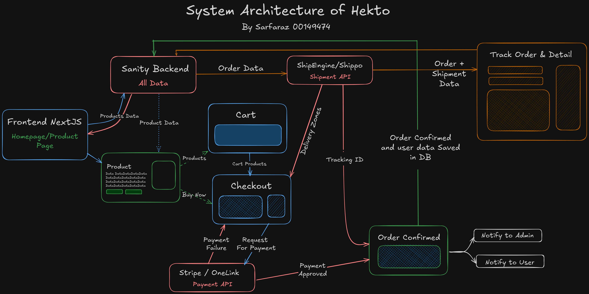

# Marketplace Technical Foundation - Hekto

## System Architecture



### Workflow
**User Registration**:
User visit signup page --> Fill Registration Form --> Verify Email by OTP --> Data Saved in Sanity

**Browsing Products**:
User visits homepage/shop --> Sanity API fetches all products -->  Find Products by search or browsing --> Click on Product --> Opens Product Page --> Sanity API fetch current product data  -->  View All Details & Availability

**Purchasing Product:**
1. User added item in cart  --> Reviewing All products moved to checkout
2. User clicked on Buy Button  --> Moved to Checkout

Step 1/2  --> Provided Address & contact details --> Payment Details --> Payment API Process Payment  --> IF FAILED return to Checkout ELSE  --> Request to Shipment API --> Get Shipment ID --> Prepare Order data and Sanity API save the order data --> Order Confirmed --> User & Admin Notified

**Order Tracking**
User visits order tracking page --> Input Order Number or Tracking ID --> Sanity API fetch order data --> Shipment API for current product location / status --> Display data on frontend


## API Specification Document:

| Endpoint | Methods | payloads | response |
|----------|---------|----------|----------|
| /products | GET |  | `[{"title":"King Chair", "short_description":"this product is ... ", "product_image":"https://sanity...", "category": "chairs", "sku": "CH112HH1", "qty": 12, "price": 12000, "discount_price": 0, "specification": "Quality Wood..." }]` |
| /products | POST | `{"title":"King Chair", "short_description":"this product is ... ", "product_image":"https://sanity...", "category": "chairs", "sku": "CH112HH1", "qty": 12, "price": 12000, "discount_price": 0, "specification": "Quality Wood..." }` | `{message: "Product Created Successfully!"}` |
| /products/:id | GET |  | `{"title":"King Chair", "short_description":"this product is ... ", "product_image":"https://sanity...", "category": "chairs", "sku": "CH112HH1", "qty": 12, "price": 12000, "discount_price": 0, "specification": "Quality Wood..." }` |
| /products/:id | PUT | `{_id: "product1_ch233sd","title":"King Master Chair", "short_description":"this product is ... ", "product_image":"https://sanity...", "category": "chairs", "sku": "CH112HH1", "qty": 12, "price": 12000, "discount_price": 0, "specification": "Quality Wood..." }` | `{message: "Product Updated Successfully!"}` |
| /products/:id | DELETE | `{_id: "product1_ch233sd","title":"King Master Chair", "short_description":"this product is ... ", "product_image":"https://sanity...", "category": "chairs", "sku": "CH112HH1", "qty": 12, "price": 12000, "discount_price": 0, "specification": "Quality Wood..." }` | `{message: "Product Updated Successfully!"}` |
| /user | POST | `{"name":"Sarfaraz", "email":"sarfarazunarr@gmail.com", "phone":03012345678, "image": File, "address": "Hala New" }` | `{message: "User Created Successfully! Need Email Verification"}` |
| /user | GET | | `[{"name":"Sarfaraz", "email":"sarfarazunarr@gmail.com", "phone":03012345678, "image": File, "address": "Hala New" }...]` |
| /user/:id | GET | | `{"name":"Sarfaraz", "email":"sarfarazunarr@gmail.com", "phone":03012345678, "image": File, "address": "Hala New" }` |
| /user/:id | PUT | `{"name":"Sarfaraz", "email":"sarfarazunarr@gmail.com", "phone":03012345678, "image": File, "address": "Hala New" }` | `{message: "User Updated Successfully!"}` |
| /user/:id | DELETE |  | `{message: "User Deleted Successfully!"}` |
| /payment | POST | `{"type":"stripe", "amount": 12.00, "status" : "received"` | `{message: "Payment Processed Successfully!"}` |
| /order | POST | `{"products":[{_type: "product", reference: "productcgb"}...], "customer":{_type: "customer", reference: "customer1bbsd"}, "amount":1200, "payment": {_type:"payment", reference: "paymetn233h23"}, order_status: "processing", "datetime": "20251216TT94759", shippingId: "233B2324B" }` | `{message: "Order Placed Successfully!"}` |
| /order | GET | | `[{"products":[{_type: "product", reference: "productcgb"}...], "customer":{_type: "customer", reference: "customer1bbsd"}, "amount":1200, "payment": {_type:"payment", reference: "paymetn233h23"}, order_status: "processing", "datetime": "20251216TT94759", shippingId: "233B2324B" }...]` |
| /order/:id | GET | | `{"products":[{_type: "product", reference: "productcgb"}...], "customer":{_type: "customer", reference: "customer1bbsd"}, "amount":1200, "payment": {_type:"payment", reference: "paymetn233h23"}, order_status: "processing", "datetime": "20251216TT94759", shippingId: "233B2324B" }` |
| /order/:id | PUT | `{order_status: "delivered"}` | `{"message": "Order Status Updated"}` |
| /order/:id | DELETE | None | `{"message": "Order Deleted"}` |
| /track-order | GET | `{order_id: '1212H34', token: "skh237323nfkjdf"}` | `{"products":[{_type: "product", reference: "productcgb"}...], "customer":{_type: "customer", reference: "customer1bbsd"}, "amount":1200, "payment": {_type:"payment", reference: "paymetn233h23"}, order_status: "processing", "datetime": "20251216TT94759", shippingId: "233B2324B", departure_city: "Karachi", currentLocation: "Hyderabad", destination: "Hala", expected_delivery: "19-01-2025"  }` |


## Data Schema Design (SANITY):
1. Customer Schema
```typescript

export const Customer = {
    name: "customer",
    title: "Customer",
    type: "document",
    fields: [
        {
            name:'name',
            title:'Name',
            type: 'string',
            validation: (rule: any) => rule.required()
        },
        {
            name: 'email',
            title: 'Email',
            type: 'string',
            validation: (rule: any) => rule.email()
        },
        {
            name: 'phone',
            title: 'Phone',
            type: 'number'
        },
        {
            name:'image',
            title: 'Image',
            type: 'image'
        },
        {
            name:'address',
            title: 'Address',
            type: 'string'
        }
    ]

}
```


2. Product Schema
```typescript

export const Product =  {
  name: 'product',
  type: 'document',
  title: 'Product',
  fields: [
    {
      name: 'name',
      type: 'string',
      title: 'Name',
      validation: (Rule: any) => Rule.required().error('Name is required'),
    },
    {
      name: 'image',
      type: 'image',
      title: 'Image',
      options: {
        hotspot: true,
      },
      description: 'Upload an image of the product.',
    },
    {
      name: 'price',
      type: 'string',
      title: 'Price',
      validation: (Rule: any) => Rule.required().error('Price is required'),
    },
    {
      name: 'description',
      type: 'text',
      title: 'Description',
      validation: (Rule: any) =>
        Rule.max(150).warning('Keep the description under 150 characters.'),
    },
    {
      name: 'discountPercentage',
      type: 'number',
      title: 'Discount Percentage',
      validation: (Rule: any) =>
        Rule.min(0).max(100).warning('Discount must be between 0 and 100.'),
    },
    {
      name: 'isFeaturedProduct',
      type: 'boolean',
      title: 'Is Featured Product',
    },
    {
      name: 'stockLevel',
      type: 'number',
      title: 'Stock Level',
      validation: (Rule: any) => Rule.min(0).error('Stock level must be a positive number.'),
    },
    {
      name: 'category',
      type: 'string',
      title: 'Category',
      options: {
        list: [
          { title: 'Chair', value: 'Chair' },
          { title: 'Sofa', value: 'Sofa' },
        ],
      },
      validation: (Rule: any) => Rule.required().error('Category is required'),
    },
  ],
};
```


3. Order Schema
```typescript

export const Order = {
    name: "order",
    title: "Order",
    type: "document",
    fields: [
        {
            name:'products',
            title:'Products',
            type: 'array',
            of: [{type: "product"}]
        },
        {
            name: 'customer',
            title: 'Customer',
            type: 'reference',
            to: [{type: "customer"}]
        },
        {
            name: 'amount',
            title: 'Amount',
            type: 'number'
        },
        {
            name: "payment",
            title: "Payment",
            type: "reference",
            to: [{type: "payment"}]
        }
        
        {
            name:'order_status',
            title: 'Order Status',
            type: 'string',
            options:{
                list:[
                   {title: 'Processing', value: 'processing'},
                   {title: 'Packed', value: 'packed'}, 
                   {title: 'Under Delivery', value: 'under_deliver'}, 
                   {title: 'Delivered', value: 'delivered'}, 
                ]
            }
        },
        {
            name:'date_time',
            title: 'Date & Time',
            type: 'datetime'
        },
        {
            name:'shippingId',
            title: 'Shipping ID',
            type: 'string'
        }
    ]

}
```


4. Payment Schema
```typescript

export const Payment = {
    name: "payment",
    title: "Payment",
    type: "document",
    fields: [
        {
            name:'type',
            title:'Type',
            type: 'string',
            options: {
                list: [
                    {title: 'Stripe', value: 'stripe'},
                    {title: 'OneLink', value: 'onelink'},
                    {title: 'Cash on Delivery', value: 'cod'},
                ]
            }
        },
        {
            name: 'amount',
            title: 'Amount',
            type: 'number'
        },
        {
            name:'status',
            title: 'Status',
            type: 'string',
            options:{
                list:[
                   {title: 'Pending', value: 'pending'},
                   {title: 'Failed', value: 'failed'} 
                   {title: 'Recieved', value: 'recieved'} 
                ]
            }
        }
    ]

}

```


5. Offer
```typescript

export const Offer = {
    name: "offer",
    title: "Offer",
    type: "document",
    fields: [
        {
            name: "type",
            title: "Discount Type",
            type: "string",
            list: [
                {title: "Percentage": value: "percentage"},
                {title: "Flat Off": value: "flat_off"},
                {title: "Free Delivery": value: "free_delivery"}
            ]
        },
        {
            name: "discount",
            title: "Discount value",
            type: "number"
        },
        {
            name: "duration",
            title: "Duration in Days",
            type: "number"
        },
        {
            name: "applicable_category",
            title: "Applicable Category",
            type: "reference",
            to: [{type: "category"}]
        },
    ]
}

```


6. Category
```typescript
export const Category = {
    name: "category",
    title: "Category",
    type: "document",
    fields: [
        {
            name: "name",
            type: "string",
            title: "Category Name"
        }
    ]
}

```

`Shipping` and `Delivery Zone` data will be provided by API. We don't need to create models for them.