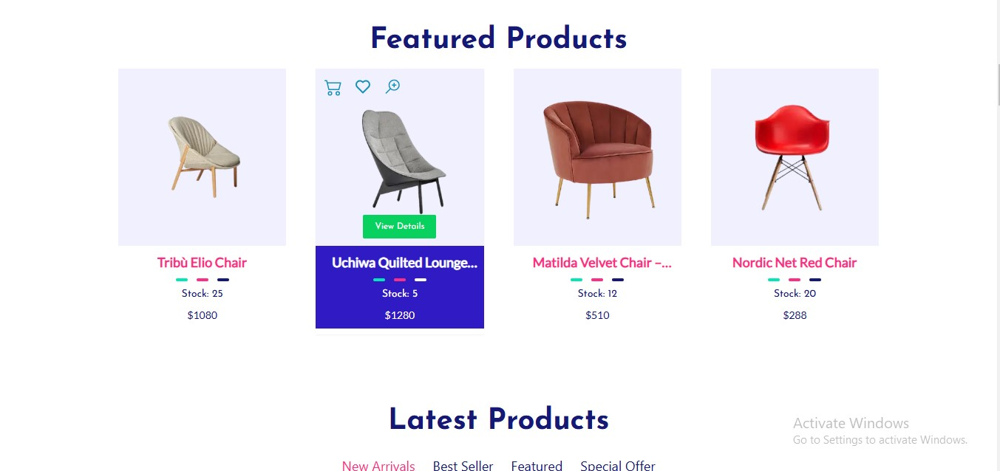
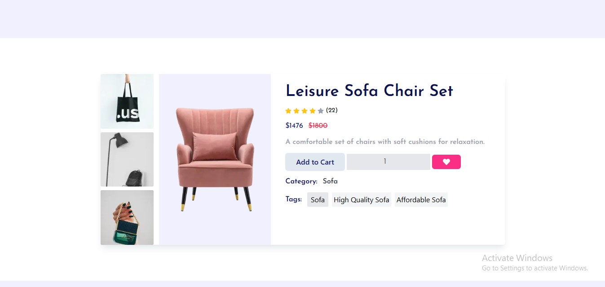
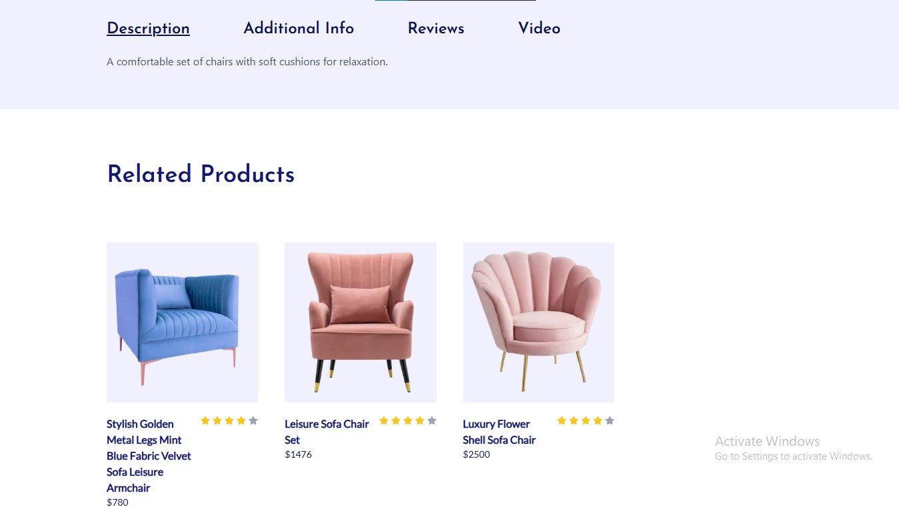
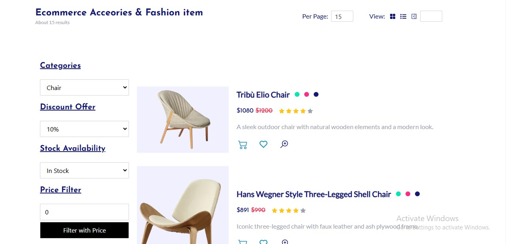
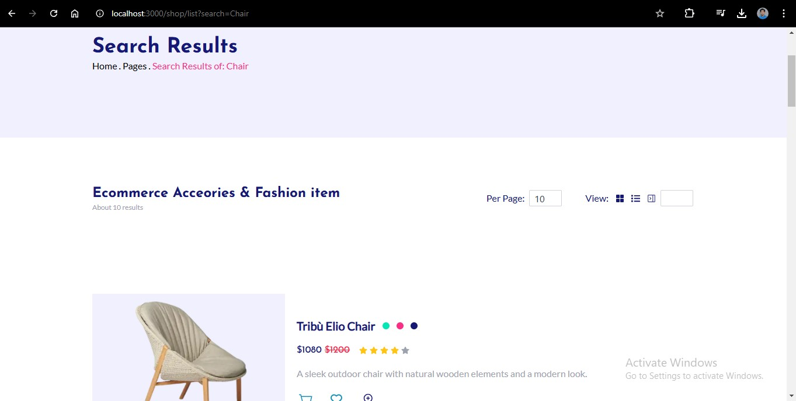

# DAY 4 OF HACKATHON 3 (GIAIC)

Today in this day 4 task we were assigned to add UI components and render api/sanity data there and make our website more effience, fast and functional.

## Functional Deliverables:





Other parts of website is modified with some additional features.

## Code Deliverables

Main Product Component that provide multiple product cards based on requirement

```typescript
import CategoryProduct from "./CategoryProduct"
import PRDesign1 from "./PRDesign1"
import PRDesign2 from "./PRDesign2"
import PRDesign3 from "./PRDesign3"
import ProductBarDesign from "./ProductBarDesign"

export interface ProductType{
    _id: string,
    name: string,
    description: string,
    image_url: string,
    stockLevel: string,
    price: number,
    discountPercentage:number,
    slug: string,
    category: string
}

export const finalPrice = (discountPercentage: number, price: number) => {
    if(!discountPercentage) return price;
    const amountToDeduct = (price / 100) * discountPercentage;
    const finalAmount = price - amountToDeduct;
    return finalAmount;
}

const ProductCard = ({ designType, showDots = false, data }: { designType: "SIMPLE 1/4" | "MEDIUM 1/3" | "SIMPLEST" | "CATEGORY PRODUCT" | "BAR", showDots?:boolean, data:ProductType}) => {
    return (
        <>
           {designType == "SIMPLE 1/4" && <PRDesign1 data={data} />}
           {designType == "MEDIUM 1/3" && <PRDesign2 data={data} />}
           {designType == "SIMPLEST" && <PRDesign3 data={data} showDots={showDots} />}
           {designType == "CATEGORY PRODUCT" && <CategoryProduct data={data} />}
           {designType == "BAR" && <ProductBarDesign data={data} />}
        </>
    )
}

export default ProductCard
```

Search Page
```typescript
"use client";
import Companies from '@/components/Companies'
import MainHeader from '@/components/MainHeader'
import Loader from '@/components/mini/Loader';
import ProductCard, { ProductType } from '@/components/mini/ProductCard'
import StoreDatahandler from '@/components/mini/StoreDatahandler'
import { client } from '@/sanity/lib/client';
import { useSearchParams } from 'next/navigation';
import React, { useEffect, useState } from 'react'


const ShopList = () => {
  const [products, setProducts] = useState<ProductType[]>();
  const [itemsPerPage, setItemsPerPage] = useState(10);
  const [loading, setLoading] = useState(false);
  const searchparams = useSearchParams();
  const getData = async () => {
    setLoading(true)
    try {
      const query = searchparams.get('search');
      let queryString = `*[_type == "product"][0..${itemsPerPage - 1}]{
        _id,
        name,
      description,
      stockLevel,
      discountPercentage,
      price,
      "image_url":image.asset->url,
      "slug": slug.current
        }`

      if(query){
        queryString = `*[(_type == "product")
      && (pt::text(name) match "${query}*" || description match "${query}*")] | score(pt::text(name) match "${query}*", boost(description match "${query}*", 3))[0..${itemsPerPage - 1}]
      {
        name,
      description,
      stockLevel,
      discountPercentage,
      price,
      "image_url":image.asset->url,
      "slug": slug.current,
        _score
        }`
      }
      
      const productsdata = await client.fetch(queryString);
      setProducts(productsdata);
      setLoading(false)
    } catch (error) {
      setLoading(false)
      console.error(error);
    }
  };

  useEffect(() => {
    getData();
  }, [itemsPerPage, searchparams]);
  return (
    <>
      <MainHeader title='Search Results' prev='Home . Pages . ' current={`Search Results of: ${searchparams.get('search')}`} />
      <StoreDatahandler itemsPerPage={itemsPerPage} setItemsPerPage={setItemsPerPage} />
      <div className="px-5 md:px-10 lg:px-40 w-full py-10">
        {loading && (
          <Loader />
        )}
        {(!products || products?.length == 0) && (
          <div className='w-full py-10 flex justify-center flex-col items-center'>
            <h3 className='text-3xl font-bold text-center text-gray-700 pt-10'>No Products Available!</h3>
          </div>
        )}
        {products && products.map((product, index) => (<ProductCard key={index} data={product} designType='BAR' showDots={true} />))}

      </div>
      <Companies />
    </>
  )
}

export default ShopList
```

Category Page
```typescript

const Category = ({params}: {params: {slug: string}}) => {
  const [products, setProducts] = useState<ProductType[]>();
  const [itemsPerPage, setItemsPerPage] = useState(10);
  const [loading, setLoading] = useState(false);

  const getData = async () => {
    setLoading(true)
    try {
      
      const query = `*[_type == "product" && category == "${params.slug}"][0..${itemsPerPage}]{_id, name, description, stockLevel, discountPercentage, price, "image_url": image.asset->url, "slug": slug.current}`;
      const product = await client.fetch(query);
      setProducts(product);
      setLoading(false)
    } catch (error) {
      setLoading(false)
      console.error(error);
    }
  };

  useEffect(() => {
    getData();
  }, [itemsPerPage]);
  return ()... //Same as above
```

Cart Store (Zustand)
```typescript

import { ProductType } from '@/components/mini/ProductCard';
import { create } from 'zustand'

export interface CartProduct extends ProductType {
    quantity: number,
    subPrice: number,
    totalAmount: number,
}

interface CartStateI {
    cart: CartProduct[],
    addToCart: (item: CartProduct) => void,
    removeFromCart: (itemId: string) => void,
    clearCart: () => void,
    updateQuantity: (itemId: string, quantity: number) => void
}

const useCartStore = create<CartStateI>()((set) => ({
    cart: [],
    addToCart: (item) => set((state) => ({ cart: [...state.cart, item] })),
    removeFromCart: (itemId) => set((state) => ({ cart: state.cart.filter((item) => item._id !== itemId) })),
    clearCart: () => set({ cart: [] }),
    updateQuantity: (itemId, quantity) => set((state) => ({ cart: state.cart.map((item) => item._id === itemId ? { ...item, quantity, totalAmount: item.subPrice * quantity } : item) }))
}));

export const calculateAmount = (cartItems: CartProduct[]) => {
    let amount;
    if (cartItems.length <= 0) { amount = 0; }
    else {
        amount = cartItems.reduce((acc, cartProduct) => acc + cartProduct.totalAmount, 0);
    }
    return amount;
}

export default useCartStore;

```
Wishlist store is created in that same way

Cart Page Script
```typescript
"use client";
import MainHeader from '@/components/MainHeader'
import React, { useEffect, useState } from 'react'
import CartItem from './CartItem'
import { IoIosCheckmarkCircle } from 'react-icons/io'
import Link from 'next/link'
import useCartStore, { calculateAmount } from '@/store/cartStore'

const CartPage = () => {
    const {cart, clearCart} = useCartStore();
    const [subAmount, setSubAmount] = useState(0);
    useEffect(() => {
        const updatedAmount = calculateAmount(cart);
        setSubAmount(updatedAmount)
    }, [cart]);
    return (...) // Same Randering
}
```

Cart Btns Component
```typescript
"use client";
import React, { useState } from 'react'
import { BsCart2 } from 'react-icons/bs'
import useCartStore from '@/store/cartStore'
import { ProductType } from './ProductCard';
import { toast } from 'react-toastify';
import Link from 'next/link';
import { FiShoppingCart } from 'react-icons/fi';

const CartBtns = ({ varation, data, amount }: { varation: number, data?: ProductType, amount?: number }) => {
    const { addToCart, cart, updateQuantity } = useCartStore();
    const [qty, setQty] = useState(1);
    const handleCartAction = () => {
        const load = toast.loading('Adding to Cart...', { autoClose: 2000 });
        if(typeof data == "undefined" || typeof amount == "undefined") {
            toast.update(load, { render: "Data not defined!", type: "success", isLoading: false, autoClose: 1000 });
            return;
        }
        try {
            const cartData = { ...data, quantity: qty, subPrice: amount, totalAmount: (qty * amount) };
            const isAlreadyExist = cart.findIndex((pr) => pr._id == data._id);
            if (isAlreadyExist != -1) {
                const record = cart[isAlreadyExist]
                updateQuantity(data._id, record.quantity + qty);
            } else {
                addToCart(cartData)
            }
            toast.update(load, { render: "Item Added in to cart!", type: "success", isLoading: false, autoClose: 1000 });
        } catch (error) {

            toast.update(load, { render: "Failed: Try Again", type: "error", isLoading: false, autoClose: 1000 });
            console.log(error);
        }
    }
    return (
        <>
            {varation == 1 && (
                <div className='flex justify-center items-center bg-transparent text-[#1490b9] hover:bg-[#e6e6e7] hover:text-offNavyBlue cursor-pointer rounded-full size-8 p-1' onClick={handleCartAction}>
                    <BsCart2 size={25} />
                </div>
            )}
            {varation == 2 && (
                <div className='flex justify-between items-center'>
                    <button className='px-6 py-2 text-navyBlue font-semibold bg-slate-200 rounded-md hover:bg-navyBlue hover:text-white' onClick={handleCartAction}>Add to Cart</button>
                    <input type="number" value={qty} className='bg-gray-200 text-gray-500 border-none outline-none text-center font-josefin-sans text-lg py-1 mx-1 font-normal' onChange={(e) => setQty(Number.parseInt(e.target.value))} />
                </div>
            )}
            {varation == 3 && (
                <Link href={"/cart"} className='bg-transparent text-white border-none outline-none pl-3 text-lg flex justify-start items-center gap-2'><FiShoppingCart color={'white'} /> {cart.length > 0 && <span className='bg-white rounded-full text-sm text-purple size-5 text-center font-semibold'>{cart.length}</span>}</Link>
            )}

        </>
    )
}

export default CartBtns
```
And some other components are also created and modified like checkout, wishlist


## Final
In this update i have created and modified components and converted repeated code snippets to moduler components and make my code centralized and created functions that could be used in full website rather then in a component.
I have also integrated sanity api in all components where it is required i have faced some issue but resolved them by debugging queries in `studio` and following `documentation`. 
I have also created `schemas` for `customer` and `order` and connected them with sanity. An api route is also creatd for handling orders. But will be completed in future.


